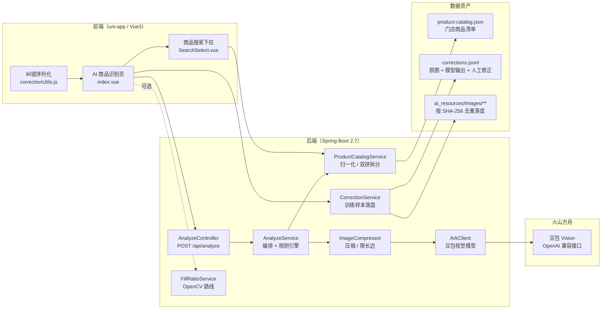
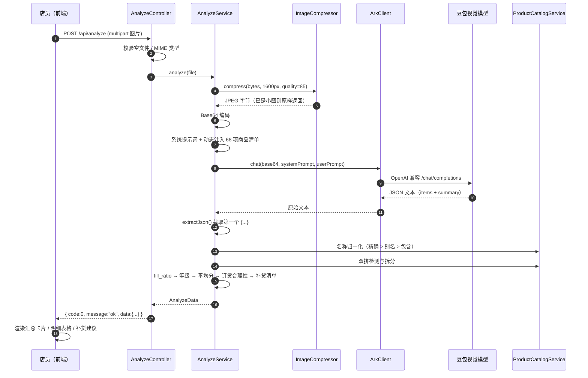
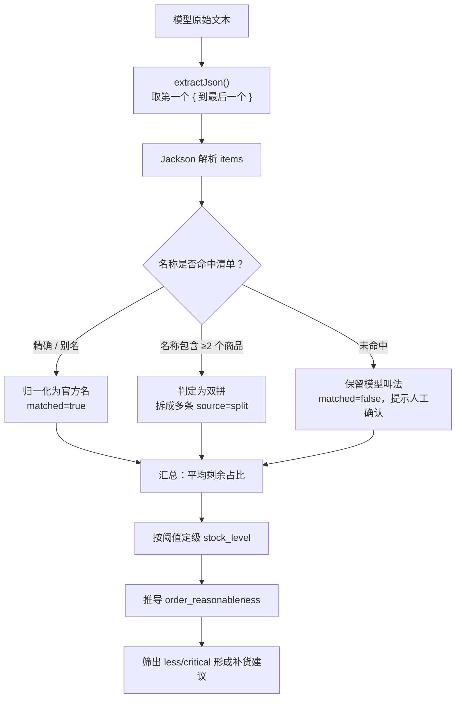
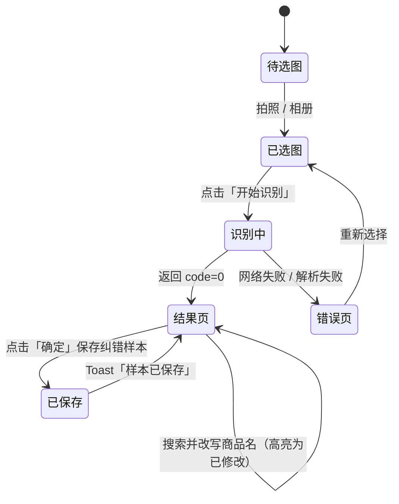
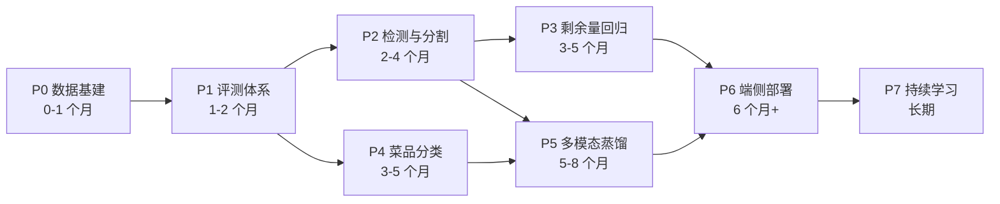

# ai-qingdian｜AI 熟食展示柜盘点与订货合理性分析

> 拍一张展示柜照片，自动识别每个托盘的菜品名称、剩余量占比、充足度等级与补货建议，并把人工纠错结果沉淀成训练数据，形成「识别 → 纠错 → 训练 → 更准」的数据飞轮。

`Java 8` · `Spring Boot 2.7` · `火山方舟豆包视觉模型` · `OpenCV (JavaCPP)` · `uni-app / Vue 3` · `32 个单元测试`

---

## 目录

- [1. 项目背景](#1-项目背景)
- [2. 核心功能](#2-核心功能)
- [3. 系统架构](#3-系统架构)
- [4. 识别流程分析](#4-识别流程分析)
- [5. 关键设计决策](#5-关键设计决策)
- [6. 快速开始（后端）](#6-快速开始后端)
- [7. 快速开始（前端 uni-app）](#7-快速开始前端-uni-app)
- [8. API 文档](#8-api-文档)
- [9. 训练数据格式](#9-训练数据格式)
- [10. 测试](#10-测试)
- [11. 项目结构](#11-项目结构)
- [12. 后期 AI 训练计划](#12-后期-ai-训练计划)
- [13. Roadmap](#13-roadmap)
- [14. 安全与隐私](#14-安全与隐私)
- [15. License](#15-license)

---

## 1. 项目背景

熟食/卤味连锁门店的展示柜盘点长期依赖店长肉眼巡检，存在三个痛点：

| 痛点 | 具体表现 |
| --- | --- |
| 盘点靠经验 | 每个托盘剩多少、要不要补货，全凭目测，不同店长结论不一致 |
| 订货量拍脑袋 | 备货少了断货，备货多了报损，缺少统一的量化依据 |
| 数据无沉淀 | 巡检结果写在纸上，无法复盘，也没有可用于建模的结构化数据 |

`ai-qingdian`（AI 轻点）把这件事变成一次拍照：后端调用视觉大模型逐盘识别菜品与**剩余量占比**，再用**规则引擎**把占比换算成充足度、整体库存水平和订货合理性，最后给出补货清单。

关键点是：它不只是一个「调模型」的 Demo，而是包含**人工纠错回流**的完整闭环——店员在识别结果上改正名称后，原图 + 模型原始输出 + 修正标注会被落盘成 `corrections.jsonl`，直接构成后续模型微调的训练集。**产品第一天上线就在生产训练数据。**

---

## 2. 核心功能

- **餐盘级识别**：一次识别照片中所有托盘的菜品名称与剩余量占比（0–100 整数）。
- **充足度分级**：`充足 / 一般 / 较少 / 严重不足 / 未知`，阈值可在配置中调整。
- **订货合理性判断**：按整体平均剩余占比给出 `合理 / 基本合理 / 偏低 / 明显偏低` 的结论与文字理由。
- **补货建议**：自动列出剩余量偏少的托盘。
- **商品清单归一化**：内置 68 项门店商品目录，支持别名映射（如 `卤豆腐丝 → 云丝`），把模型的自由叫法统一到官方名称。
- **双拼自动拆分**：模型把 `木耳拼贡菜` 识别成一条时，后端按清单自动拆成两条独立记录。
- **人工纠错闭环**：前端可搜索/改写商品名，一键保存为训练样本。
- **OpenCV 备选路线**：不调大模型，纯本地图像算法完成餐盘检测 + 剩余占比估算，用于成本对比与交叉验证。
- **可观测性**：返回模型原始文本，并打印「压缩 / 调用 / 解析」分段耗时日志。

---

## 3. 系统架构



**技术选型说明**

| 层次 | 选型 | 理由 |
| --- | --- | --- |
| 视觉识别 | 豆包视觉大模型（火山方舟 OpenAI 兼容接口） | 免训练即可支持任意菜品，冷启动成本最低；输出 JSON 便于结构化解析 |
| 业务判定 | 后端规则引擎 | 阈值类业务逻辑放在代码里，可审计、可配置、可单测，不交给模型自由发挥 |
| 兜底路线 | OpenCV（JavaCPP 绑定） | 纯 JVM 内运行、不依赖 Python 服务，成本为零，可与大模型结果交叉验证 |
| 前端 | uni-app + Vue 3 `script setup` | 一套代码同时覆盖 H5 与小程序/App，门店用手机即可拍照 |
| 数据闭环 | JSONL 追加写 | 天然适合训练数据，一行一条、可流式读取、易做版本切分 |

---

## 4. 识别流程分析

### 4.1 主链路时序



### 4.2 分步拆解

**① 接入层校验**（`AnalyzeController`）
校验文件非空、MIME 属于 `jpg/png/bmp/gif`；同时依赖 `spring.servlet.multipart.max-file-size=10MB` 做体积兜底。失败统一走 `GlobalExceptionHandler`，返回 `{code:2}`。

**② 图片压缩**（`ImageCompressor`）
视觉模型按 token 计费且看图慢，因此先把最长边压到 1600px、JPEG 质量 85。若入参已是小尺寸 JPEG（前端 `sizeType:["compressed"]` 已压过），直接原样返回，避免「解码—重编码」的额外开销。

**③ 提示词工程**（`AnalyzeService.buildSystemPrompt`）
系统提示词写死输出契约（严格 JSON、只要占比不要份数、双拼拆两条、认不出不许编造、confidence 分级标准）；门店商品清单在运行时注入，改商品目录不用改代码，也不占用模型记忆。

**④ 模型调用**（`ArkClient`）
走火山方舟 OpenAI 兼容协议，`thinking-type=disabled` 换取低延迟，读超时给到 180s。模型返回后**同时记录原始文本**：解析失败时把原始内容回吐到接口，便于快速定位是「模型跑偏」还是「解析器 bug」。

**⑤ 结果解析与归一化**（`AnalyzeService.parseResult`）



**⑥ 规则引擎算结论**
占比 → 等级：`≥70 充足 / ≥40 一般 / ≥15 较少 / <15 严重不足 / -1 未知`（阈值见 `application.yml` 的 `ark.ratio-level`，全部可配）。
等级 → 订货合理性：`充足且均分≥90 → 偏高；充足 → 合理；一般 → 基本合理；较少 → 偏低；严重不足 → 明显偏低`。

> 设计取舍：**识别交给模型，判定交给规则**。大模型擅长「看见」，不擅长「遵守阈值」；把业务判定收敛到可单测的纯函数，才能保证门店之间口径一致。

**⑦ 人工纠错回流**（`CorrectionService`）
前端只提交「被改过的行」（`correctionUtils.js` 负责 diff），后端按 SHA-256 对原图去重落盘，再把 `raw_model_text + items + corrections` 追加写入 `corrections.jsonl`。加 `ReentrantLock` 保证并发追加不串行错乱。

---

## 5. 关键设计决策

| 决策 | 备选方案 | 最终选择与原因 |
| --- | --- | --- |
| 识别载体 | 自训练检测模型 vs 视觉大模型 | 选大模型：零样本可用，1 天上线；训练数据在此过程中自动积累，为后期换自研模型铺路 |
| 剩余量定义 | 数份数 vs 估占比 | 只估占比：熟食散装难以计数，占比才是订货决策真正需要的信号，也更容易让模型给出一致答案 |
| 双拼托盘 | 拆开训练 / 当异常丢弃 | 名称包含检测 + 自动拆分：贴合真实陈列（一个托盘拼两种菜），避免数据被污染 |
| 阈值位置 | 让模型直接输出等级 | 后端计算：模型输出越少字段越稳，阈值可随门店策略调整而无需重训 |
| 图片存储 | Base64 入库 / 对象存储 | 本地文件 + SHA-256 命名：训练数据可直接被 DataLoader 读取，同时天然去重 |
| OpenCV 路线 | 删除 / 保留 | 保留为独立 `/api/analyze-cv`：零成本、可离线，可作为大模型结果的对照基线 |

---

## 6. 快速开始（后端）

### 6.1 环境要求

- JDK 8+（项目以 `java.version=1.8` 编译）
- Maven 3.6+（或直接使用仓库自带的 `mvnw`）
- 一个火山方舟 API Key 与视觉模型接入点（[火山方舟控制台](https://console.volcengine.com/ark)）

### 6.2 配置 API Key

**不要把 Key 写进 `application.yml`**。用环境变量注入：

```bash
export ARK_API_KEY="你的火山方舟 API Key"
```

或在 `backend/src/main/resources/` 下新建 `application-local.yml`（已被 `.gitignore` 忽略）覆盖配置：

```yaml
ark:
  api-key: "你的 Key"
  model: "你的推理接入点 ID（ep-xxxxxxxx）或预置模型 ID"
```

### 6.3 平台适配（重要）

`pom.xml` 中 OpenCV 原生库按平台引入，默认给了 macOS Apple Silicon：

```xml
<classifier>macosx-arm64</classifier>
```

换平台时同步修改两处 `classifier`：

| 平台 | classifier |
| --- | --- |
| macOS Apple Silicon | `macosx-arm64` |
| macOS Intel | `macosx-x86_64` |
| Linux x86_64 | `linux-x86_64` |
| Windows x86_64 | `windows-x86_64` |

### 6.4 启动与验证

```bash
cd backend

# 运行全部单元测试（32 个用例，无需联网、无需 API Key）
mvn test

# 启动服务，默认 http://localhost:8080
ARK_API_KEY=xxx mvn spring-boot:run
```

启动后可以直接用命令行冒烟：

```bash
# 1) 商品清单
curl http://localhost:8080/api/products

# 2) 上传图片识别（主链路，会调用豆包）
curl -X POST http://localhost:8080/api/analyze -F "file=@/path/to/shelf.jpg"

# 3) OpenCV 路线（不调用模型）
curl -X POST "http://localhost:8080/api/analyze-cv?grid=3x5" -F "file=@/path/to/shelf.jpg" -o cv.json
```

浏览器打开 `http://localhost:8080/cv-test.html` 可以在页面上传图片，直观查看 OpenCV 检出的餐盘框与占比（`static/cv-test.html`）。

### 6.5 自定义商品清单

编辑 `backend/src/main/resources/product-catalog.json`，支持别名：

```json
[
  { "name": "荣昌卤鹅" },
  { "name": "云丝", "aliases": ["卤豆腐丝", "干豆腐丝", "凉拌豆腐丝"] }
]
```

清单会在每次识别时动态注入提示词，改完重启即可，无需调整模型。

---

## 7. 快速开始（前端 uni-app）

前端是一个 uni-app（Vue 3）项目中的独立页面，三个文件即可集成：

| 文件 | 作用 |
| --- | --- |
| `frontend/pages/aiqingdian/index.vue` | 页面主体：选图、识别、结果表格、纠错保存 |
| `frontend/pages/aiqingdian/SearchSelect.vue` | 带搜索的商品名称下拉组件 |
| `frontend/pages/aiqingdian/correctionUtils.js` | 纠错 diff 与提交报文组装（纯函数，易测） |
| `frontend/api/aiQingdian.js` | 后端接口封装（`uni.request` / `uni.uploadFile`） |

### 集成步骤

1. 把 `frontend/pages/aiqingdian/` 整个目录复制到你的 uni-app 项目 `pages/` 下；
2. 把 `frontend/api/aiQingdian.js` 复制到项目 `api/` 下；
3. 在 `pages.json` 注册页面：

```json
{
  "path": "pages/aiqingdian/index",
  "style": {
    "navigationBarTitleText": "AI 商品识别",
    "navigationStyle": "custom"
  }
}
```

4. 配置后端地址（`api/aiQingdian.js` 读取 `VUE_APP_AIQingdianBaseUrl`）：

```bash
# 项目根目录 .env 或 .env.production
VUE_APP_AIQingdianBaseUrl=https://your-backend.example.com
```

> 注意：uni-app 会在构建时静态替换 `process.env.VUE_APP_*`，因此**不要**在代码里加 `typeof process !== "undefined"` 之类的运行时判断，否则会把已替换的地址短路成空串，请求退化为相对路径。

5. 后端已配置 `CorsConfig` 允许跨域；若前端域名固定，建议把 `CorsConfig` 中的允许来源收紧为白名单。

### 页面交互



---

## 8. API 文档

统一响应结构：`{ "code": 0, "message": "ok", "data": {...} }`，`code` 取值 `0 成功 / 1 服务异常 / 2 参数错误 / 3 文件过大`。字段统一 `snake_case`。

### `GET /api/products`

返回门店商品清单，供前端纠错下拉使用。

```json
{
  "code": 0,
  "message": "ok",
  "data": [
    { "name": "荣昌卤鹅" },
    { "name": "云丝", "aliases": ["卤豆腐丝", "干豆腐丝"] }
  ]
}
```

### `POST /api/analyze`

`multipart/form-data`，字段 `file`：展示柜照片（jpg/png/bmp/gif，≤10MB）。

```json
{
  "code": 0,
  "message": "ok",
  "data": {
    "total_trays": 17,
    "stock_score": 82,
    "stock_level": "充足",
    "order_reasonableness": "合理",
    "reason": "共识别 17 个陈列餐盘（其中 2 个双拼已拆分），平均剩余占比约 82%，其中 3 盘剩余偏少。整体库存充足，本次订货量合理。",
    "restock_suggestions": [
      { "name": "木耳", "fill_ratio": 40, "level": "一般", "confidence": "high" }
    ],
    "items": [
      {
        "name": "麻辣毛豆",
        "original_name": null,
        "model_raw_name": "麻辣毛豆",
        "fill_ratio": 90,
        "level": "充足",
        "confidence": "high",
        "matched": true,
        "source": "model",
        "description": "上层最左侧托盘内的青黄色毛豆"
      }
    ],
    "raw": "模型原始返回文本（排查用）"
  }
}
```

### `POST /api/corrections`

`multipart/form-data`，字段 `file`：原图；`json`：纠错报文。

```json
{
  "raw_model_text": "模型原始输出",
  "items": [
    {
      "row": 16,
      "recognized_name": "芸豆",
      "selected_name": "荣昌卤鹅",
      "model_raw_name": "芸豆",
      "fill_ratio": 40,
      "confidence": "high",
      "description": "下层右侧黑色托盘，乳白色芸豆"
    }
  ],
  "corrections": [
    {
      "row": 16,
      "recognized_name": "芸豆",
      "corrected_name": "荣昌卤鹅",
      "unclear": false,
      "fill_ratio": 40,
      "confidence": "high",
      "description": "下层右侧黑色托盘，乳白色芸豆"
    }
  ]
}
```

响应：`{"code":0,"data":{"session_id":"...","image_file":"images/2026/09/07/xxxx.jpg","corrections_count":1}}`

> 只提交被修改或标记「看不清」的行；未修改的行不会重复入库，避免训练集被正确样本稀释。

### `POST /api/analyze-cv`（可选路线）

`multipart/form-data`，`file` 必填，`grid` 选填（如 `3x5`，缺省自动检测餐盘）。
返回每个餐盘在**原图坐标系**下的 `x/y/width/height`、`fill_ratio`、`food_pixels/empty_pixels/unknown_pixels`，以及一张带标注框的 `annotated_base64` 图片。

**OpenCV 算法思路**：最长边缩放 → 自适应阈值 + 形态学闭运算 + 轮廓检测定位托盘 → 用托盘边框一圈像素的 Lab 中位数估计「空盘背景色」→ 盘内与背景色距离超阈值的像素判为食物 → 面积占比即 `fill_ratio`，高光反光像素单列不参与计算。

---

## 9. 训练数据格式

每保存一次纠错，`corrections.jsonl` 追加一行（图片同时按 SHA-256 落盘，相同图片不重复存储）：

```json
{
  "session_id": "a4d64e330d1f4c6fa9d88b926aa0e810",
  "created_at": "2026-09-07T16:11:44.042+08:00",
  "image": { "file": "images/2026/09/07/<sha256>.jpg", "sha256": "<sha256>" },
  "model": "doubao-seed-2-0-lite-260428",
  "raw_model_text": "模型原始 JSON 文本",
  "items": [{ "row": 1, "recognized_name": "麻辣毛豆", "selected_name": "麻辣毛豆", "fill_ratio": 90, "confidence": "high" }],
  "corrections": [{ "row": 16, "recognized_name": "芸豆", "corrected_name": "荣昌卤鹅", "unclear": false, "fill_ratio": 40 }]
}
```

完整样例见 `docs/samples/corrections.sample.jsonl`，字段说明见 `docs/training-data.md`。

这张表同时提供了三类监督信号：

| 监督信号 | 用途 |
| --- | --- |
| `corrections[].corrected_name` | 菜品细粒度分类 / 名称归一化模型的标签 |
| `corrections[].unclear = true` | 难例挖掘，反光/遮挡样本优先送标 |
| `items[].fill_ratio` + 人工复核 | 剩余量回归的真值（需补充人工标注阶段） |

---

## 10. 测试

```bash
cd backend && mvn test
# Tests run: 32, Failures: 0, Errors: 0, Skipped: 0
```

覆盖范围：

| 测试类 | 关注点 |
| --- | --- |
| `AnalyzeServiceTest` | 占比分级、订货合理性、名称归一化、双拼拆分、异常/截断 JSON 解析 |
| `ProductCatalogServiceTest` | 精确 / 别名 / 包含匹配优先级 |
| `CorrectionServiceTest` | 纠错报文校验、图片去重、JSONL 追加 |
| `FillRatioServiceTest` | OpenCV 路线餐盘检测与占比计算、网格模式 |
| `ImageCompressorTest` | 小图直通、超限缩放、非图片报错 |

测试全部使用本地构造数据，不依赖网络与真实 API Key，可直接放进 CI。

---

## 11. 项目结构

```text
ai-qingdian/
├── backend/                                  # Spring Boot 服务
│   ├── pom.xml
│   └── src/
│       ├── main/java/com/aiqingdian/
│       │   ├── controller/                   # Analyze / Correction / FillRatio 三个入口
│       │   ├── service/                      # AnalyzeService 编排、ArkClient、OpenCV、压缩、清单、纠错
│       │   ├── dto/                          # 接口与训练数据的请求/响应模型
│       │   ├── config/                       # ark / cv / correction / cors 配置绑定
│       │   └── exception/                    # 统一异常与响应码
│       ├── main/resources/
│       │   ├── application.yml               # 模型、阈值、OpenCV、存储路径配置
│       │   ├── product-catalog.json          # 门店商品清单（含别名）
│       │   └── static/cv-test.html           # OpenCV 路线可视化调试页
│       └── test/java/...                     # 32 个单元测试
├── frontend/                                 # uni-app 前端页面（可直接复制进现有工程）
│   ├── pages/aiqingdian/{index.vue, SearchSelect.vue, correctionUtils.js}
│   └── api/aiQingdian.js
└── docs/
    ├── architecture.md                       # 架构与流程详解
    ├── api.md                                # 接口文档
    ├── training-data.md                      # 训练数据字典
    ├── ai-training-plan.md                   # 后期 AI 训练计划（详细版）
    └── samples/corrections.sample.jsonl      # 脱敏训练样本
```

> 说明：`frontend/` 是从一个完整 uni-app 工程中抽出的 AI 识别模块（页面 + 请求层 + 纠错工具），方便直接阅读与移植；`backend/ai_resources/` 存放运行时产生的图片与训练数据，默认不纳入版本库。

---

## 12. 后期 AI 训练计划

当前方案用「视觉大模型 + 规则引擎」实现冷启动，短期性价比最高，但存在三个天花板：**① 按次调用有成本；② 离线/弱网门店不可用；③ 剩余量占比只能靠模型估计，缺少像素级真值。**
因此规划了一条从「调模型」到「自研模型」的渐进路线，且每一阶段都复用项目已经在沉淀的纠错数据。



### P0 数据基建（0–1 个月）

- 把 `corrections.jsonl` 转成标准数据集：`images/ + labels.csv`，每条样本含 `image_path, dish_name, fill_ratio, confidence, source, store_id, captured_at`。
- 制定标注规范：明确「剩余量占比」的定义（食物覆盖托盘底面积的百分比）、双拼托盘拆分规则、遮挡/反光的处理口径，形成《标注手册》保证多人标注一致。
- **划分策略按门店 + 日期切分**（不是随机切分），避免同一天同一柜台的相邻帧同时进入训练与验证集造成指标虚高。
- 目标规模：名称分类 ≥ 5,000 张、占比回归 ≥ 3,000 张（含 20% 以上的低置信/难例）。
- 数据增强：玻璃反光、保鲜膜褶皱、夹子遮挡、俯视/斜视角度、不同色温灯光。

### P1 评测体系（1–2 个月）

先有尺子再谈模型。构建 500 张 Golden Set，固定指标口径：

| 指标 | 说明 | 目标 |
| --- | --- | --- |
| 托盘检测 Recall | 检出的托盘 / 真实托盘 | ≥ 0.98（漏检比误检更伤业务） |
| 名称 Top-1 准确率 | 归一化后与官方名一致 | ≥ 0.92 |
| 双拼拆分准确率 | 拼盘被正确拆分 | ≥ 0.95 |
| 占比 MAE | 与人工标注占比的平均绝对误差 | ≤ 8 个百分点 |
| 分级准确率 | 充足/一般/较少/严重不足 四档一致 | ≥ 0.90 |
| 人工修正率 | 店员改名的行数占比 | 从基线持续下降 |

同时在线上用「影子模式」并行跑新模型与现有大模型，逐条对比，不直接影响门店。

### P2 检测与分割（2–4 个月）

- 训练 **YOLOv8 / YOLO11-seg** 做托盘检测 + 实例分割，替代 OpenCV 规则法的托盘定位（规则法在反光、叠盘、异形盘上误检明显）。
- 输出 `bbox + mask`，mask 直接决定后续占比计算的精度上限。
- 推理侧导出 ONNX，用 **ONNX Runtime Java** 在现有 Spring Boot 服务内直接推理，不引入 Python 服务，保持部署架构简单。
- 用现有 OpenCV 路线的检测结果做预标注，人工只修正错误框，降低标注成本。

### P3 剩余量回归（3–5 个月）

- 在 P2 的 mask 基础上，用「食物像素面积 / 托盘有效面积」计算几何占比作为强基线。
- 引入轻量回归头（ResNet-18 / MobileNetV3 backbone）融合几何特征与视觉特征，输出 `fill_ratio`，损失用 Huber 抗离群。
- 对高度堆叠的菜品（如毛豆、卤鹅块）单目面积会低估，可评估单目深度估计（Depth Anything）或加入托盘标尺先验做校正。
- 用 3,000+ 张人工标注占比做训练，目标 MAE ≤ 8 个百分点，显著优于大模型的纯估计。

### P4 菜品细粒度分类（3–5 个月）

- 闭集分类：以 68 项商品清单为类别，训练 backbone + ArcFace/CosFace 度量学习；别名在标签层合并，天然解决「卤豆腐丝 → 云丝」归一化。
- 样本不均衡处理：类别重采样 + 长尾损失；对新品/长尾品类保留「开放词表 + 人工确认」兜底路径（现有 `matched=false` 机制）。
- 与 P2 联动：先把托盘裁切出来再分类，避免整图干扰。

### P5 多模态模型蒸馏 / SFT（5–8 个月）

- 用纠错数据构造 instruction 数据集：`(图片, 提示词) → 严格 JSON`，把人工修正后的结果作为首选答案（DPO 偏好对：修正后 > 模型原始）。
- 用 **LoRA/QLoRA** 微调开源 VLM（Qwen2.5-VL-7B / InternVL 系列），降低对第三方 API 的依赖与成本；训练目标包含「严格输出 JSON + 不编造 + 双拼拆分」。
- 把大模型的输出作为教师信号，蒸馏到 2B 级小模型，兼顾准确率与推理成本。
- 训练框架建议：PyTorch + HuggingFace `transformers/peft/trl` + `deepspeed`；数据与实验用 **DVC + MLflow** 做版本管理，保证每次指标可追溯。

### P6 端侧与成本优化（6 个月+）

- 目标：门店设备（Android 平板 / 自助终端）本地完成推理，弱网可用、单次成本趋近于 0。
- 量化：INT8 / FP16 + ONNX Runtime Mobile 或 ncnn / MNN；必要时用 TensorRT 部署到门店网关。
- 分级推理策略：`置信度高 → 端侧直接出结果`；`置信度低 → 上传云端大模型兜底`，在成本与准确率之间取平衡。

### P7 持续学习（长期）

- **数据飞轮**：线上低置信样本 + 人工修正 → 每周回流 → 增量训练 → 影子评测 → 灰度发布。
- 监控指标：各门店名称修正率、占比分布漂移、季节性菜品（如夏季凉菜）出现频次。
- 版本治理：模型版本、数据集版本、评测报告三者绑定，任何一次上线都可回滚、可复现。

### 里程碑与验收

| 阶段 | 时间 | 交付物 | 验收标准 |
| --- | --- | --- | --- |
| P0 | 第 1 月 | 数据集 + 标注手册 | 有效样本 ≥ 5,000，双人标注一致率 ≥ 0.95 |
| P1 | 第 2 月 | Golden Set + 评测脚本 | 指标可一键复现，影子模式跑通 |
| P2 | 第 4 月 | 托盘分割模型（ONNX） | 检测 Recall ≥ 0.98，JVM 内推理 ≤ 300ms |
| P3 | 第 5 月 | 占比回归模型 | 占比 MAE ≤ 8pp |
| P4 | 第 5 月 | 菜品分类模型 | Top-1 ≥ 0.92 |
| P5 | 第 8 月 | LoRA 微调 VLM | 端到端分级准确率 ≥ 0.93，调用成本下降 ≥ 50% |
| P6 | 第 9 月 | 端侧推理包 | 单张推理 ≤ 1s，离线可用 |

---

## 13. Roadmap

- [x] 主链路识别（大模型 + 规则引擎）
- [x] 商品清单归一化与双拼拆分
- [x] 人工纠错与训练数据落盘
- [x] OpenCV 本地占比路线 + 可视化调试页
- [ ] 纠错数据自动转换为训练集（导出脚本 + 数据版本管理）
- [ ] Golden Set 评测脚本与自动化指标报告
- [ ] 托盘检测/分割模型（ONNX，JVM 内推理）
- [ ] 占比回归与菜品分类模型
- [ ] VLM LoRA 微调与端侧量化部署
- [ ] 多门店 / 多柜台数据看板与趋势分析
- [ ] GitHub Actions CI（多平台 classifier 矩阵 + Golden Set 评测流水线）

---

## 14. 安全与隐私

- 仓库内**不包含**任何真实 API Key：`application.yml` 仅保留 `${ARK_API_KEY:}` 空默认值，本地用环境变量或 `application-local.yml` 覆盖。
- `backend/ai_resources/` 下的门店实拍图与 `corrections.jsonl` 默认被 `.gitignore` 排除，开源版本只提供脱敏样例。
- 若要把本项目用于生产，请把 `CorsConfig` 的来源收紧为白名单，并在网关层增加鉴权与限流。

---

## 15. License

[MIT](LICENSE)
