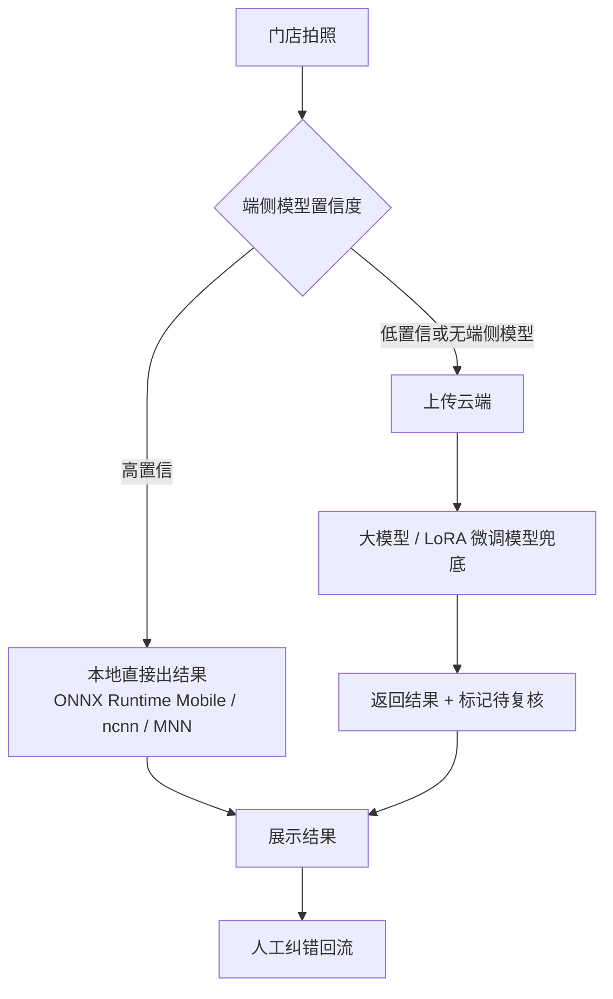

# 后期 AI 训练计划（详细版）

> 目标：把当前的「大模型 API + 规则引擎」方案，逐步演进为「自研检测/分类/回归模型 + 小参数量多模态模型」的可控、低成本、可离线部署体系，全程复用线上纠错数据。

## 0. 现状与差距

| 现状能力 | 局限 | 训练要解决的问题 |
| --- | --- | --- |
| 视觉大模型逐盘输出名称 + 占比 | 按次计费、延迟 3–10s、弱网不可用、结果不可控（可能编造） | 用自研模型替代/兜底，降本提准 |
| OpenCV 规则法检测托盘 | 反光、叠盘、异形盘误检率高 | 用实例分割替代规则法 |
| 占比来自模型主观估计 | 无像素级真值，误差不可量化 | 用 mask 面积 + 回归模型给出可解释结果 |
| 纠错数据落盘为 JSONL | 尚未形成标准数据集与评测集 | 数据治理 + Golden Set + 指标闭环 |

## 1. P0 数据基建（第 1 个月）

### 1.1 数据资产盘点

```text
ai_resources/
├── images/YYYY/MM/DD/<sha256>.jpg     # 原始样本图
└── corrections.jsonl                  # 会话级标注（模型输出 + 人工修正）
```

### 1.2 标准化数据集 Schema

统一导出为 `dataset-vX/`：

```text
dataset-vX/
├── images/                            # 可按需裁切为托盘小图
├── detections.jsonl                   # 托盘 bbox/mask 标注
├── dishes.jsonl                       # 托盘级菜品标签
├── fill_ratio.jsonl                   # 托盘级占比真值
└── manifest.json                      # 版本、样本数、切分信息、校验哈希
```

字段示例（`dishes.jsonl`）：

```json
{"sample_id":"s000123","image":"images/2026/03/01/ab12….jpg","tray_bbox":[120,340,260,180],
 "label":"云丝","label_id":17,"raw_model_name":"卤豆腐丝","source":"corrected",
 "store_id":"S001","captured_at":"2026-03-01T11:20:00+08:00","lighting":"indoor-warm"}
```

### 1.3 标注规范要点

- **剩余量占比定义**：食物可见投影面积 / 托盘有效底面积 × 100%，取整到 5% 的粒度（降低标注方差）。
- **双拼托盘**：必须拆分为两条样本，且各自独立标注占比。
- **遮挡与反光**：可见面积 < 60% 的托盘标 `unclear=true`，不作为训练正样本，只进难例池。
- **边界情况**：空盘记 0；堆高溢出记 100；保鲜膜下不可辨认的标 unclear。
- 双人标注抽查一致率要求 ≥ 0.95，不达标则回炉修订规范。

### 1.4 数据增强

| 维度 | 增强方式 |
| --- | --- |
| 光学 | 玻璃反光、保鲜膜高光、色温偏移、过曝/欠曝 |
| 几何 | 俯视/斜视透视变换、轻微旋转、缩放裁剪 |
| 遮挡 | 随机贴图模拟夹子、价签、顾客手部遮挡 |
| 设备 | 不同手机摄像头的噪声与锐化风格 |

注意：**占比回归任务慎用几何增强**，透视变换会改变面积比例，必须同步变换标注 mask。

### 1.5 数据集切分

- 按 `store_id + captured_at(日期)` 分组切分，杜绝相邻帧泄漏。
- 训练 : 验证 : 测试 = 8 : 1 : 1；测试集冻结。
- 测试集必须覆盖全部在售品类、至少 3 种光照、至少 2 种拍摄角度。

## 2. P1 评测体系（第 2 个月）

### 2.1 Golden Set

人工精细化标注 500 张（含 100 张高难样本：反光/遮挡/叠盘/新品），作为唯一裁判集，任何模型上线前必须在此评测。

### 2.2 指标定义

| 任务 | 指标 | 计算方式 | 目标 |
| --- | --- | --- | --- |
| 托盘检测 | Recall / Precision / mAP50 | 与人工框 IoU ≥ 0.5 判正 | Recall ≥ 0.98 |
| 分割 | mask IoU | 实例分割掩码交并比 | ≥ 0.85 |
| 菜品分类 | Top-1 / Top-3 准确率 | 归一化到官方名后比对 | Top-1 ≥ 0.92 |
| 双拼拆分 | 拆分准确率 | 应拆尽拆且不多拆 | ≥ 0.95 |
| 占比回归 | MAE / ≤10pp 命中率 | 与人工标注占比的绝对误差 | MAE ≤ 8pp |
| 分级 | 四档准确率 | 充足/一般/较少/严重不足 | ≥ 0.90 |
| 线上 | 人工修正率 | 被修改行数 / 总行数 | 持续下降 |

### 2.3 影子模式

新模型与现网大模型**并行推理**，结果只落库不展示；每日对比差异样本，人工复核后归入「新模型正确/旧模型正确/两者皆错」三类，形成模型迭代的决策依据。

## 3. P2 托盘检测与实例分割（第 2–4 个月）

- **模型**：YOLOv8-seg / YOLO11-seg（也可评估 RT-DETR + SAM 组合）。
- **预标注**：用现有 `/api/analyze-cv` 的检测框做初筛，人工仅修正漏检/误检，标注效率可提升 3–5 倍。
- **训练配置建议**：
  - 输入 1280×1280（托盘在整图中占比小，分辨率比 batch 更重要）
  - epochs 100–300，`patience=30` 早停
  - 类别数 1（只检托盘），不同菜品交给分类模型
- **推理落地**：导出 ONNX（opset 17），使用 **ONNX Runtime Java** 在 Spring Boot 内推理，保持「单进程、无 Python 依赖」的部署形态；如需 GPU，可外挂 Triton 推理服务。
- **验收**：Golden Set 检测 Recall ≥ 0.98，单图 JVM 内推理 ≤ 300ms（CPU 4 核）。

## 4. P3 剩余量占比回归（第 3–5 个月）

两条技术路线并行评估：

| 路线 | 做法 | 优点 | 风险 |
| --- | --- | --- | --- |
| 几何法 | mask 内食物像素面积 / 托盘有效面积 | 完全可解释、零训练 | 堆高菜品会低估 |
| 学习法 | backbone + 回归头预测 `fill_ratio` | 可学习堆高、颜色混淆等先验 | 需要真值标注 |

**融合方案**：以几何占比为基线特征，拼接 CNN 特征后接 2 层 MLP 回归，损失用 Huber（抗离群标注）。对堆高明显的品类（毛豆、卤块）可引入单目深度（Depth Anything）或托盘高度先验做校正。

- 训练数据：3,000+ 张带人工占比标注的托盘图。
- 数据增强：翻转、亮度/对比度抖动、JPEG 压缩；不做透视变换。
- 验收：Golden Set MAE ≤ 8pp，`≤10pp 命中率` ≥ 0.85。

## 5. P4 菜品细粒度分类（第 3–5 个月）

- **闭集设定**：类别 = 门店商品清单（当前 68 类，可扩展）；别名在标签层合并，天然解决「卤豆腐丝 → 云丝」的归一化问题。
- **模型**：ConvNeXt-Tiny / EfficientNet-B0 / MobileNetV3-Large（端侧备选）。
- **损失**：ArcFace 或 CosFace 度量学习 + 类别重采样，缓解长尾。
- **难例挖掘**：每轮训练后用验证集挑出高损失样本，优先补充人工标注（`confidence=low` 的线上样本直接进池）。
- **开放类兜底**：保留 CLIP 零样本匹配 + 前端人工确认（现有 `matched=false` 链路），新品上架当天即可用。
- **验收**：Golden Set Top-1 ≥ 0.92，Top-3 ≥ 0.98。

## 6. P5 多模态模型 SFT / 蒸馏（第 5–8 个月）

### 6.1 数据构造

```json
{
  "image": "images/…jpg",
  "conversations": [
    { "role": "user", "content": [{"type": "image"}, {"type": "text", "text": "识别展示柜中每个托盘的菜品与剩余量占比，只输出 JSON。"}] },
    { "role": "assistant", "content": "{\"items\":[{\"name\":\"云丝\",\"fill_ratio\":90,\"confidence\":\"high\"}]}" }
  ],
  "meta": { "source": "human_corrected", "model_version": "v3" }
}
```

要点：

- 首选答案为**人工修正后**的结果（而非模型原始输出），这是纠错数据最大的价值。
- 同时保留「模型原始输出」作为 DPO 的 rejected 样本，构造偏好对（chosen = 人工修正，rejected = 模型原始）。
- 负样本要包含：编造名称、输出多余解释文字、双拼未拆分、占比越界 —— 直接针对现网 badcase。

### 6.2 训练方案

| 项 | 建议 |
| --- | --- |
| 基座 | Qwen2.5-VL-7B / InternVL2.5-8B（开源、中文强、有视觉编码器） |
| 方法 | LoRA（rank 16–32）/ QLoRA 4bit，冻结视觉编码器或仅解冻最后几层 |
| 框架 | `transformers` + `peft` + `trl`（SFTTrainer / DPOTrainer）+ `deepspeed` ZeRO-2 |
| 超参起点 | lr 1e-4（LoRA）、warmup 3%、epoch 2–3、bf16、max_len 2048 |
| 输出约束 | 训练目标中强化「仅输出 JSON」，并在推理侧叠加 JSON Schema 校验与失败重试 |
| 蒸馏 | 用 7B 模型对未标注图片批量生成伪标签，训练 2B 级小模型，目标是成本下降 ≥ 50% 而分级准确率下降 ≤ 2pp |

### 6.3 验收

- 端到端「分级准确率」≥ 0.93（在 Golden Set 上，与大模型基线对比）。
- 输出非法 JSON 比例 ≤ 0.5%。
- 单次推理成本相比第三方 API 下降 ≥ 50%（含自建 GPU 摊销）。

## 7. P6 端侧部署与成本优化（第 6 个月+）



- 量化：FP16 / INT8 PTQ，必要时 QAT；推理引擎优先 ONNX Runtime，移动端可选 ncnn/MNN，网关侧可用 TensorRT。
- 目标：单张推理 ≤ 1s、离线可用、单店零调用成本。
- 端侧模型组合：YOLO-seg（托盘）+ MobileNetV3（分类）+ MLP（占比回归），参数量可控制在 15MB 以内。

## 8. P7 持续学习与 MLOps（长期）

| 环节 | 工具 / 机制 |
| --- | --- |
| 数据版本 | DVC + 对象存储，`data-vYYYY.MM` tag |
| 实验追踪 | MLflow（记录数据版本、代码 commit、超参、指标） |
| 模型注册 | MLflow Model Registry，区分 Staging / Production |
| 自动化 | CI 跑单测；Nightly 跑 Golden Set 评测并出报告 |
| 上线策略 | 影子模式 → 1 家门店灰度 → 全量；指标劣化自动回滚 |
| 漂移监控 | 名称修正率、占比分布、新品出现频次、置信度分布 |

**北极星指标**：线上人工修正率。它同时反映识别准确率与店员体验，且不依赖离线标注，是最真实的模型质量信号。

## 9. 里程碑总表

| 阶段 | 时间 | 交付物 | 验收标准 |
| --- | --- | --- | --- |
| P0 | 第 1 月 | 标准化数据集 + 标注手册 | 有效样本 ≥ 5,000；双人一致率 ≥ 0.95 |
| P1 | 第 2 月 | Golden Set + 评测脚本 + 影子模式 | 指标一键复现；每日差异报告 |
| P2 | 第 4 月 | 托盘分割模型（ONNX） | Recall ≥ 0.98；推理 ≤ 300ms |
| P3 | 第 5 月 | 占比回归模型 | MAE ≤ 8pp |
| P4 | 第 5 月 | 菜品分类模型 | Top-1 ≥ 0.92 |
| P5 | 第 8 月 | LoRA 微调 VLM + 蒸馏小模型 | 分级准确率 ≥ 0.93；成本 ↓ ≥ 50% |
| P6 | 第 9 月 | 端侧推理包 | 单张 ≤ 1s；离线可用 |
| P7 | 持续 | 自动化训练流水线 | 周级增量训练、灰度发布、自动回滚 |

## 10. 风险与对策

| 风险 | 影响 | 对策 |
| --- | --- | --- |
| 标注成本高 | 进度延期 | OpenCV/大模型预标注 + 人工修正；只标难例 |
| 占比真值主观 | 指标不可信 | 明确占比定义、5% 粒度、双人标注一致率门槛 |
| 长尾/新品 | 分类失败 | 保留开放词表 + 人工确认兜底；`matched=false` 直达人工 |
| 端侧算力不足 | 无法离线 | 模型分级：端侧跑检测+分类，占比回归上云或按需触发 |
| 数据合规 | 法务风险 | 数据本地化存储、不入仓库、脱敏后再用于开源演示 |
