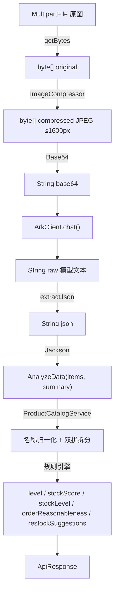
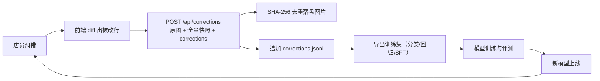

# 架构与流程详解

## 1. 分层职责

| 层 | 类 | 职责 | 依赖方向 |
| --- | --- | --- | --- |
| 接入层 | `AnalyzeController` / `CorrectionController` / `FillRatioController` | 参数校验、MIME 判定、响应包装 | → Service |
| 编排层 | `AnalyzeService` | 压缩 → 调用模型 → 解析 → 归一化 → 规则定级 | → 基础设施 |
| 基础设施 | `ImageCompressor`、`ArkClient`、`FillRatioService`、`ProductCatalogService`、`CorrectionService` | 各自单一能力，可独立替换 | → 外部 SDK / 文件系统 |
| 模型层 | `dto/` | 接口与训练数据契约 | 无 |
| 配置层 | `config/` | `ark.*` / `cv.*` / `correction.*` 类型安全绑定 | 无 |
| 异常层 | `exception/` + `GlobalExceptionHandler` | 统一错误码与错误信息 | 无 |

**扩展点**：`AnalyzeService` 只依赖 `ArkClient` 的方法签名。若要替换为自研模型，只需新增一个实现同签名的 `LocalVisionClient` 并调整注入，`AnalyzeController` 与前端零改动。

## 2. 主链路数据流



耗时观测点（`AnalyzeService.analyze` 内埋点日志）：

```
识别耗时统计：图片压缩 {t1-t0}ms，模型调用 {t2-t1}ms，结果解析 {t3-t2}ms，总计 {t3-t0}ms
```

实际表现通常是「模型调用」占 90% 以上，因此优化重点在提示词长度、图片尺寸与 `thinking-type`，而非后端解析。

## 3. 规则引擎

### 3.1 占比 → 等级

```
ratio < 0        → 未知
ratio ≥ 70       → 充足
ratio ≥ 40       → 一般
ratio ≥ 15       → 较少
ratio < 15       → 严重不足
```

阈值来自 `ark.ratio-level.{sufficient,moderate,low}`，可按门店/品类调整。

### 3.2 整体水平 → 订货合理性

| 整体等级 | 平均占比 | 结论 |
| --- | --- | --- |
| 充足 | ≥ 90 | 偏高（备货过多，注意报损） |
| 充足 | < 90 | 合理 |
| 一般 | — | 基本合理 |
| 较少 | — | 偏低 |
| 严重不足 | — | 明显偏低 |
| 未知 | — | 未知 |

### 3.3 补货建议

凡等级为 `较少` 或 `严重不足` 的托盘进入 `restock_suggestions`；`reason` 文本会把「托盘总数、双拼拆分条数、平均占比、补货盘数、未匹配条数、模型备注」拼成一句话，方便直接展示给店长。

## 4. 名称归一化与双拼拆分

匹配优先级（`ProductCatalogService.findBestMatch`）：

```
精确名称  >  别名精确  >  包含匹配（取名称最长者）
```

双拼判定（`AnalyzeService.parseResult` 内）：

1. 若名称**不是**任意商品的精确/别名匹配；
2. 且该名称**包含** ≥ 2 个商品名（如 `木耳拼贡菜`、`芸豆豇豆`）；
3. 则拆成多条 `source=split` 的子项，保留父项的 `fill_ratio` 与 `confidence`，并把 `original_name` 记为组合原名。

未命中任何规则的名称保留原样并置 `matched=false`，前端以蓝色高亮提示人工确认——**宁可提示人工，也不硬猜**，从源头保证训练数据质量。

## 5. 纠错数据闭环



闭环的三个关键约定：

1. **只存被修改的行**：避免正确样本稀释训练信号，同时让「修正率」成为可监控的线上指标。
2. **保存模型原始文本**：可区分「模型认错」与「解析器出错」，是排障与 DPO 偏好对的数据来源。
3. **图片按内容哈希命名**：天然去重，且训练时可直接按哈希校验数据完整性。

## 6. 可观测性与容错

- 图片压缩 / 模型调用 / 结果解析三段耗时日志。
- 模型原始返回完整落日志，解析失败时再随响应回吐（截断保护）。
- 统一异常映射：`BadRequestException → code 2`、`ArkException → code 1`、`CvException → code 1`、文件超限 → `code 3`。
- 前端对失败态提供「查看模型原始返回」折叠区，缩短线上定位时间。
